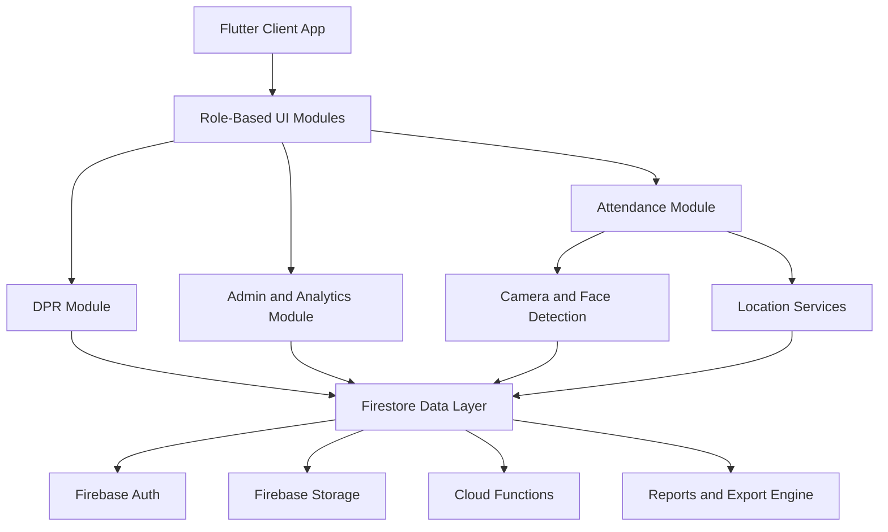

# Civil DPR

> Smart Construction Execution Platform for Digital DPR, Face-Based Attendance, and Role-Driven Site Operations.

<p align="left">
	<a href="https://github.com/Vaibhav-1430/Civil-DPR/stargazers"></a>
	<a href="https://github.com/Vaibhav-1430/Civil-DPR/network/members"></a>
	<a href="https://github.com/Vaibhav-1430/Civil-DPR/issues"></a>
	<a href="https://github.com/Vaibhav-1430/Civil-DPR/commits/main"></a>
</p>

<p align="left">
	
	
	
	
	
</p>

---

## 📌 Table of Contents

- [Screenshots and Demo](#screenshots-and-demo)
- [Problem Statement](#problem-statement)
- [Solution](#solution)
- [Core Features](#core-features)
- [Tech Stack](#tech-stack)
- [App Architecture](#app-architecture)
- [Getting Started](#getting-started)
- [Permissions](#permissions)
- [Future Scope](#future-scope)
- [Contribution](#contribution)
- [License](#license)
- [Author](#author)

---

## 📸 Screenshots and Demo

> Replace the placeholders below with your real product screenshots and recordings.

### Mobile Experience

| Login / Face Verify | Attendance Check-In | DPR Entry |
|---|---|---|
|  |  |  |

### Admin Dashboard Experience

| Dashboard Home | Team Monitoring | Reports and Exports |
|---|---|---|
|  |  |  |

### Demo Video

- Product Walkthrough: [Watch Demo](https://youtu.be/your-demo-link)
- Feature Reel (60s): [View Quick Demo](https://youtu.be/your-short-demo-link)

---

## 🎯 Problem Statement

Construction teams usually manage field attendance, site logs, and DPRs through fragmented tools: paper registers, ad-hoc WhatsApp messages, and delayed spreadsheet updates.

This creates business-critical risks:

- Inaccurate attendance records and proxy check-ins
- Delayed daily progress reporting from sites
- No real-time visibility for management
- High reconciliation effort for payroll and compliance
- Weak accountability across contractors, supervisors, and engineers

---

## 💡 Solution

Civil DPR unifies site attendance, face-assisted verification, geolocation evidence, and Daily Progress Reports in one platform.

What the product enables:

- Trusted attendance with photo + location context
- Structured DPR capture from site teams
- Role-based dashboards for admins and leadership
- Report generation for operational and management decisions
- Faster, audit-friendly communication between field and office

---

## ✨ Core Features

### 1) Attendance with Photo + Location
- One-tap check-in/check-out flows
- GPS coordinates and address enrichment
- Timestamped attendance evidence
- Offline-friendly sync patterns for unstable networks

### 2) Face Recognition Layer
- Face detection pipeline using ML Kit
- Capture quality checks before submission
- Designed to reduce proxy attendance and identity mismatch

### 3) DPR (Daily Progress Report) System
- Structured worklog entry by project/team
- Progress snapshots with context and traceability
- Standardized reporting format across sites

### 4) Admin Dashboard
- Role-based control for super admin, admin, and supervisors
- Workforce visibility across projects
- Team performance and attendance monitoring

### 5) Reports and Exports
- Attendance and DPR report generation
- PDF workflows for sharing and compliance records
- Operational insights for decision-making

<details>
<summary><strong>Feature Modules Included</strong></summary>

- Auth and role management
- Attendance and face verification
- DPR and project workflows
- Analytics and reporting
- Leave and profile management
- Super admin and supervisor modules

</details>

---

## 🏗️ Tech Stack

| Layer | Technologies |
|---|---|
| App | Flutter, Dart |
| State and Navigation | Provider, GetIt, GoRouter |
| Backend and Auth | Firebase Core, Firebase Auth, Cloud Firestore |
| Files and Media | Firebase Storage, Image Picker, Image Cropper |
| Intelligence | Google ML Kit Face Detection |
| Location and Maps | Geolocator, Geocoding, Google Maps Flutter |
| Notifications | Firebase Messaging, Flutter Local Notifications |
| Reports | PDF, Printing, Open File |
| Local Data | Hive, Shared Preferences |
| Analytics and Networking | Firebase Analytics, Dio, RxDart |

---

## 📱 App Architecture

Civil DPR follows a modular, feature-oriented architecture for maintainability and scale.



Design principles:

- Feature-first module organization
- Service abstraction in core layer
- Secure, role-driven access boundaries
- Extensible for SaaS-scale multi-project operations

---

## 🚀 Getting Started

### Prerequisites

- Flutter SDK (3.x)
- Dart SDK (3.2+)
- Firebase project configured
- Android Studio or VS Code
- Java 17+ (recommended for modern Android builds)

### 1. Clone Repository

```bash
git clone https://github.com/Vaibhav-1430/Civil-DPR.git
cd Civil-DPR
```

### 2. Install Dependencies

```bash
flutter pub get
```

### 3. Configure Firebase

Make sure these are correctly set:

- Android config: `android/app/google-services.json`
- iOS config: `ios/Runner/GoogleService-Info.plist`
- FlutterFire config: `lib/firebase_options.dart`

### 4. Run the App

```bash
flutter run
```

### 5. Build Release (Example)

```bash
flutter build apk --release
```

<details>
<summary><strong>Optional: Deploy Cloud Functions</strong></summary>

```bash
cd functions
npm install
firebase deploy --only functions
```

</details>

---

## 🔐 Permissions

Civil DPR requires the following permissions for core workflows:

| Permission | Why It Is Needed |
|---|---|
| Camera | Attendance photo capture and face verification |
| Location (Foreground) | Geo-tagging attendance and site actions |
| Storage / Files | Report generation, export, and share workflows |
| Notifications | Attendance reminders and app alerts |
| Network Access | Realtime sync with Firebase services |

> Security note: access should be role-based and least-privilege, especially for admin operations.

---

## 📊 Future Scope

Planned roadmap to evolve Civil DPR into a scalable SaaS platform:

- Multi-tenant architecture for multiple companies
- Subscription billing and organization plans
- AI-driven productivity insights and anomaly detection
- Advanced payroll integration from attendance data
- Predictive project delays and risk scoring
- BI dashboards with cross-project benchmarking

---

## 🤝 Contribution

Contributions are welcome.

1. Fork the repository
2. Create a feature branch: `git checkout -b feature/your-feature-name`
3. Commit changes: `git commit -m "feat: add your feature"`
4. Push branch: `git push origin feature/your-feature-name`
5. Open a Pull Request

For significant changes, open an issue first to discuss scope and approach.

---

## 📄 License

This repository currently does not include a license file.

- Recommended: add an MIT License for open collaboration
- If this is proprietary/client work, add an appropriate commercial license

---

## 👨‍💻 Author

**Vaibhav**

- GitHub: [@Vaibhav-1430](https://github.com/Vaibhav-1430)
- Project Repository: [Civil-DPR](https://github.com/Vaibhav-1430/Civil-DPR)
- Business/Collaboration Inquiries: your-email@domain.com
- Download Civil DPR App: [Download App](https://getmyapp11.netlify.app/download/CivilDpr.apk)

---

### If this project helps your team, consider giving it a star.
